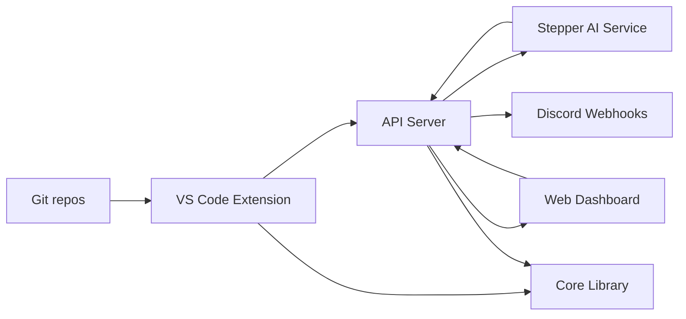

# CommitDiary

A monorepo workspace providing commit tracking and analysis through multiple interfaces.

## Project Overview

CommitDiary is a monorepo workspace using pnpm that provides commit tracking and analysis through multiple interfaces:

- **Core Library** (`packages/core`): Shared business logic for commit parsing, categorization, and metrics
- **VS Code Extension** (`packages/extension`): Desktop tool for real-time commit analysis in the editor
- **Web Dashboard** (`packages/web-dashboard`): Browser-based interface for commit visualization and Discord webhook management
- **API Server** (`packages/api`): Backend service for data processing, AI-powered report generation, and Discord notifications
- **Stepper** (`packages/stepper`): AI service for generating detailed commit reports using multiple AI providers

## Start Here

Each core package is fully documented to run standalone first, and then as part of this monorepo. Use the links below to jump into setup, flow, and contribution details.

- Core Library: [packages/core/README.md](packages/core/README.md)
- API Server: [packages/api/README.md](packages/api/README.md)
- Web Dashboard: [packages/web-dashboard/README.md](packages/web-dashboard/README.md)
- VS Code Extension: [packages/extension/README.md](packages/extension/README.md)
- Stepper (AI Orchestrator): [packages/stepper/README.md](packages/stepper/README.md)

## System Flow (Mermaid)



## Package Map

| Package | Purpose | Standalone Setup | Connects To |
| --- | --- | --- | --- |
| Core | Parsing, categorization, metrics | [packages/core/README.md](packages/core/README.md) | Extension, API, Dashboard |
| Extension | Local commit tracking + sync | [packages/extension/README.md](packages/extension/README.md) | Core, API, Dashboard |
| API | Ingest, auth, reports, webhooks | [packages/api/README.md](packages/api/README.md) | Extension, Dashboard, Stepper |
| Web Dashboard | UI for analytics + settings | [packages/web-dashboard/README.md](packages/web-dashboard/README.md) | API |
| Stepper | AI report generation | [packages/stepper/README.md](packages/stepper/README.md) | API |

## Key Features

### 🤖 AI-Powered Commit Reports
- Automatic generation of detailed commit reports with AI analysis
- Support for multiple AI providers (OpenAI, Anthropic, Groq, etc.)
- Intelligent caching and fallback mechanisms
- Backfill support for generating reports for past commits

### 🔔 Discord Webhook Notifications
- **User Webhooks**: Configure your own Discord server to receive commit report notifications
- **Event Subscriptions**: Choose which events to receive (report completed, backfill status, sync events)
- **Rich Embeds**: Beautiful Discord messages with commit details, AI analysis, and metadata
- **Delivery Tracking**: View webhook delivery logs and statistics
- **System Monitoring**: Centralized error alerts for API and dashboard issues

### 📊 Commit Analytics
- Categorization using conventional commit patterns
- Time-based grouping (daily, weekly, monthly, yearly)
- Repository metrics and insights
- Public sharing with secure token-based links

### 🔐 Secure Authentication
- Supabase Auth integration
- API key support for programmatic access
- Row-level security (RLS) for all data access
- HMAC-SHA256 webhook signature verification

## How It Works Together

### 1. Core Library (Foundation)
- **Purpose**: Provides the core algorithms for commit analysis
- **Key Functions**:
  - `categorizeCommit()`: Classifies commits as Feature, Fix, Docs, etc. based on conventional commit patterns
  - `parseGitLog()`: Parses raw git log output into structured commit objects
  - `groupByPeriod()`: Groups commits by time periods (daily/weekly/monthly/yearly) for metrics
- **Output**: TypeScript/JavaScript modules with type definitions

### 2. VS Code Extension (User Interface - Desktop)
- **Purpose**: Integrates commit analysis directly into the development workflow
- **Functionality**:
  - Uses `simple-git` to fetch recent commits from the current workspace
  - Leverages `@commitdiary/core` to categorize each commit
  - Displays results in VS Code's output panel with format: `date — [Category] message`
- **Activation**: Runs on VS Code startup, provides `commitdiary.showCommits` command

### 3. Web Dashboard (User Interface - Browser)
- **Purpose**: Provides a web-based dashboard for commit analytics
- **Technology**: Next.js 16 with React 19, Tailwind CSS v4, Supabase authentication
- **Current State**: Has authentication setup but needs integration with core/API for commit data
- **Intended Flow**: Users log in → View commit statistics and visualizations

### 4. API Server (Backend Service)
- **Purpose**: Provides REST endpoints for commit data processing
- **Technology**: Express.js server
- **Current State**: Basic server setup, ready for commit-related endpoints
- **Future Integration**: Could serve commit data to the web dashboard, process webhooks, etc.

## Data Flow

```
Git Repository → Core Library (parse/categorize) → Extension (display in VS Code)
                                      ↓
                           API Server (serve data) → Web Dashboard (visualize)
```

## Current Status

- ✅ **Core**: Fully functional with proper TypeScript types and working algorithms
- ✅ **Extension**: Builds successfully, uses core library correctly
- ✅ **API**: Basic Express server running on port 3001
- ⚠️ **Web Dashboard**: Builds but has deprecated dependencies and configuration issues

## Development Setup

1. **Install dependencies**: `pnpm install`
2. **Build packages**: Run build commands in individual packages as needed

## Usage

### VS Code Extension
1. Navigate to `packages/extension`
2. Run `pnpm run build`
3. Package with `vsce package`
4. Install the `.vsix` file in VS Code

### API Server
1. Navigate to `packages/api`
2. Run `pnpm run dev` (starts on port 3001)

### Web Dashboard
1. Navigate to `packages/web-dashboard`
2. Run `pnpm run dev` (starts on port 3000)

## Architecture

The project follows a modular architecture where the core library is the single source of truth for commit analysis logic, consumed by both the extension and potentially the API/dashboard.
