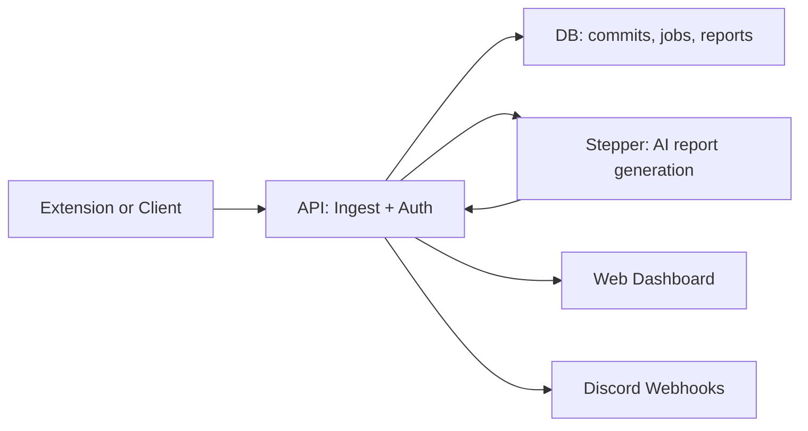

# CommitDiary API

The CommitDiary API is an Express.js server that handles commit data ingestion, AI-powered report generation, user authentication, and Discord webhook notifications.

- Back to root: [../../README.md](../../README.md)
- Related packages: [../web-dashboard/README.md](../web-dashboard/README.md) • [../extension/README.md](../extension/README.md) • [../stepper/README.md](../stepper/README.md) • [../core/README.md](../core/README.md)

## Features

- 🔐 **Authentication**: Supabase Auth + API Key support
- 📊 **Commit Management**: Ingest, store, and retrieve commit data
- 🤖 **AI Report Generation**: Async AI-powered commit report generation via Stepper
- 🔔 **Discord Webhooks**: User-configurable Discord notifications for reports
- 📈 **Repository Metrics**: Commit statistics and analytics
- 🔗 **Public Shares**: Share commit history with public links
- ⚡ **Backfill Support**: Automatic report generation for past commits

## Package Flow



## Standalone Setup

### Prerequisites

- Node.js 18+
- pnpm
- Supabase project

### Installation

```bash
cd packages/api
pnpm install
```

### Configuration

Create a .env file:

```env
# Required
SUPABASE_URL=https://your-project.supabase.co
SUPABASE_SERVICE_ROLE_KEY=your-service-role-key
PORT=3001

# API Configuration
API_BASE_URL=http://localhost:3001
DASHBOARD_URL=http://localhost:3000

# Stepper Integration
STEPPER_URL=http://localhost:3005
STEPPER_FORCE_HTTP=false

# Discord Error Monitoring (Optional)
DISCORD_ERROR_WEBHOOK_URL=https://discord.com/api/webhooks/your-webhook-url
```

### Running

```bash
# Development
pnpm dev

# Production
pnpm start
```

The API will be available at http://localhost:3001.

## Why This Setup Works

- Supabase service role key enables server-side access to protected tables
- Stepper integration offloads AI work and keeps API responsive
- Callback endpoints allow reliable report storage and webhook delivery

## API Endpoints

### Authentication

All endpoints require either:
- **Bearer Token**: `Authorization: Bearer <supabase-jwt-token>`
- **API Key**: `X-API-Key: <your-api-key>`

### User & Profile

- `GET /v1/users/profile` - Get user profile

### API Keys

- `GET /v1/users/api-keys` - List user's API keys
- `POST /v1/users/api-keys` - Generate new API key
  ```json
  {
    "name": "My VS Code Extension"
  }
  ```
- `DELETE /v1/users/api-keys/:keyId` - Revoke an API key

### Webhook Settings

- `GET /v1/settings/webhooks` - Get user's webhook settings
- `PUT /v1/settings/webhooks` - Create/update webhook settings
  ```json
  {
    "discord_webhook_url": "https://discord.com/api/webhooks/...",
    "enabled": true,
    "events": [
      "report_completed",
      "report_failed",
      "backfill_started",
      "backfill_completed",
      "backfill_failed"
    ]
  }
  ```
- `POST /v1/settings/webhooks/test` - Send test webhook
- `DELETE /v1/settings/webhooks` - Delete webhook settings
- `GET /v1/settings/webhooks/logs` - View webhook delivery logs

### Commits

- `POST /v1/ingest/commits` - Ingest commit data
  ```json
  {
    "repo": {
      "name": "my-repo",
      "remote": "https://github.com/user/repo",
      "localPath": "/path/to/repo"
    },
    "commits": [
      {
        "sha": "abc123",
        "message": "feat: add feature",
        "author_name": "John Doe",
        "author_email": "john@example.com",
        "date": "2024-01-01T12:00:00Z",
        "files": ["file1.js", "file2.js"],
        "category": "feature",
        "diff_summary": "Added new feature..."
      }
    ]
  }
  ```
- `GET /v1/users/:userId/commits` - Get commits (paginated)

### Reports

- `GET /v1/commits/:commitId/report` - Get report for a commit
- `POST /v1/commits/:commitId/report` - Trigger report generation
- `GET /v1/jobs/:jobId` - Get report generation job status

### Repositories

- `GET /v1/repos/reports` - List repositories with report settings
- `PUT /v1/repos/:repoId/reports/toggle` - Enable/disable auto-reports
  ```json
  {
    "enabled": true
  }
  ```
- `GET /v1/repos/:repoId/reports/backfill` - Get backfill status
- `POST /v1/repos/:repoId/reports/backfill/retry` - Retry failed backfill

### Shares (Public Commit Views)

- `POST /v1/shares` - Create a share
  ```json
  {
    "title": "Q4 2024 Commits",
    "description": "My commits from Q4",
    "repos": ["repo-name-1", "repo-name-2"],
    "from": "2024-10-01",
    "to": "2024-12-31",
    "expires_in_days": 7
  }
  ```
- `GET /v1/shares` - List user's shares
- `DELETE /v1/shares/:shareId` - Revoke a share
- `GET /s/:username/:token` - View public share
- `GET /v1/shares/:shareId/export?format=md` - Export share (markdown/CSV)

### Webhooks (Internal)

- `POST /v1/stepper/callback` - Stepper callback for immediate Discord delivery
- `POST /v1/webhooks/report-completed` - Stepper webhook callback (DB save)

## Discord Webhook Notifications

### User Webhooks

Users can configure their own Discord webhooks to receive notifications:

1. **Setup**: Go to Settings → Discord Notifications in the dashboard
2. **Events**: Subscribe to specific events:
   - `report_completed` - AI report generated successfully
   - `report_failed` - Report generation failed
   - `backfill_started` - Automatic backfill began
   - `backfill_completed` - Backfill finished
   - `backfill_failed` - Backfill encountered errors
   - `sync_completed` - Commit sync completed
   - `repo_enabled` - Auto-reports enabled for repository

3. **Security**: Each webhook includes HMAC-SHA256 signature for verification

### System Error Monitoring

The API can send critical errors to a centralized Discord webhook:

```env
DISCORD_ERROR_WEBHOOK_URL=https://discord.com/api/webhooks/your-webhook-url
```

Monitored errors include:
- Database connection failures
- Unhandled exceptions
- API 500 errors
- Authentication failures

## Architecture

### Report Generation Flow

1. **Trigger**: User commits or enables auto-reports
2. **Job Creation**: API creates a job record in `report_jobs` table
3. **Stepper Queue**: Job sent to Stepper for AI processing
4. **Async Processing**: Stepper generates report using AI providers
5. **Webhook Callback**: Stepper calls `/v1/webhooks/report-completed`
6. **Storage**: Report saved to `commit_reports` table
7. **User Notification**: Discord webhook sent if configured

### Error Handling

- **Network Errors**: Graceful degradation with 503 responses
- **Rate Limiting**: Token bucket algorithm for public shares
- **Retry Logic**: Exponential backoff for failed operations
- **Monitoring**: Discord alerts for critical failures

## Development

## How It Connects to the Monorepo

- Extension uses the API for ingest and API key auth: [../extension/README.md](../extension/README.md)
- Dashboard reads analytics and webhook settings from the API: [../web-dashboard/README.md](../web-dashboard/README.md)
- Stepper handles AI report generation: [../stepper/README.md](../stepper/README.md)
- Core library can be used for shared analytics: [../core/README.md](../core/README.md)

### Database Migrations

```bash
# Run migrations
cd supabase
npx supabase migration up

# Or use scripts
cd scripts
./migrate-now.sh
```

### Debugging

```bash
# Enable debug logging
LOG_LEVEL=debug npm run dev

# Check API logs
tail -f api.log
```

### Testing

```bash
# Test endpoints with curl
curl http://localhost:3001/v1/users/profile \
  -H "Authorization: Bearer <token>"

# Test webhook settings
curl -X PUT http://localhost:3001/v1/settings/webhooks \
  -H "Authorization: Bearer <token>" \
  -H "Content-Type: application/json" \
  -d '{"discord_webhook_url":"https://discord.com/api/webhooks/...","enabled":true}'

## Contributing

1. Follow Standalone Setup above
2. Run pnpm dev
3. Update tests or scripts as needed
4. Validate API routes against the dashboard and extension

Start from [../../README.md](../../README.md) for full monorepo instructions.
```

## Monitoring

### Health Checks

The API doesn't have a dedicated health endpoint, but you can check:

```bash
curl http://localhost:3001/v1/users/profile
```

### Logs

- **Console**: Structured logs with timestamps
- **File**: Optional file logging (configure with Winston)
- **Discord**: Critical errors sent to Discord webhook

### Metrics

Key metrics to monitor:
- Request latency
- Error rates
- Database connection pool
- Webhook delivery success rate
- Report generation queue length

## Deployment

### Environment Variables

Ensure all required environment variables are set:
- `SUPABASE_URL`
- `SUPABASE_SERVICE_ROLE_KEY`
- `API_BASE_URL` (for webhook callbacks)
- `STEPPER_URL` (AI service URL)

### Process Management

Use a process manager in production:

```bash
# PM2
pm2 start index.js --name commitdiary-api

# Docker
docker build -t commitdiary-api .
docker run -p 3001:3001 --env-file .env commitdiary-api
```

### CORS

Update `DASHBOARD_URL` in `.env` to match your frontend domain.

## Troubleshooting

### Webhook Not Receiving Notifications

1. Check webhook URL format: `https://discord.com/api/webhooks/...`
2. Verify webhook is enabled in settings
3. Check delivery logs: `GET /v1/settings/webhooks/logs`
4. Test webhook: `POST /v1/settings/webhooks/test`

### Report Generation Stuck

1. Check Stepper service is running
2. Verify `STEPPER_URL` is correct
3. Check report_jobs table for pending jobs
4. Check cron poller is running (logs should show polling activity)

### Database Connection Timeout

1. Increase timeout in Supabase client config
2. Check network connectivity
3. Verify `SUPABASE_URL` and `SUPABASE_SERVICE_ROLE_KEY`

## Contributing

See the main [CONTRIBUTING.md](../../CONTRIBUTING.md) in the repository root.

## License

See [LICENSE](../../LICENSE) file.
